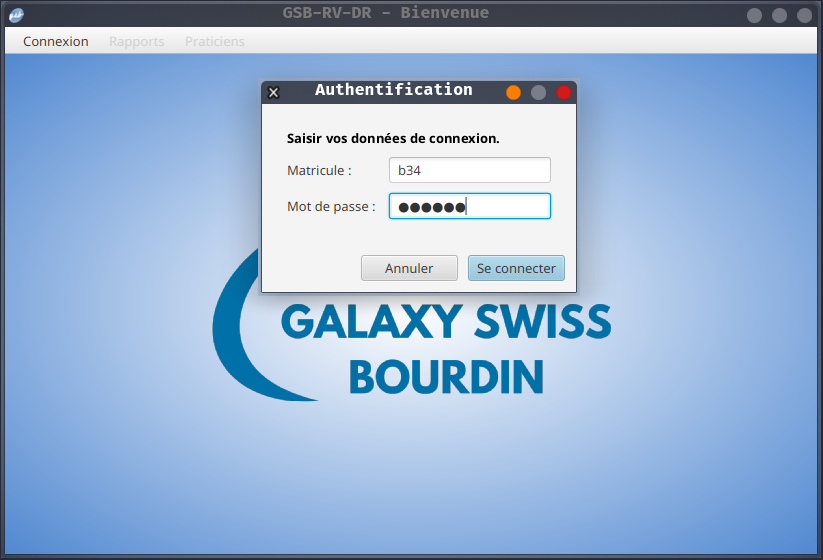
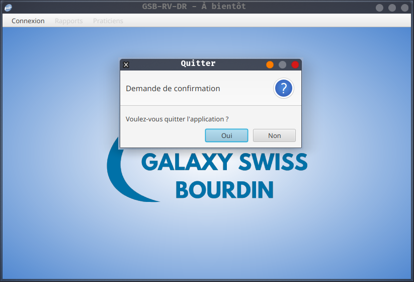

GSB RV DR [](https://github.com/AladdineDev/GSB-RV-DR/blob/master/LICENSE.md)
========================

GSB Rapports Visite - module Délégué Régional – par [@AladdineDev](https://github.com/AladdineDev)

[](https://openjdk.java.net/)
[](https://openjfx.io/)
[](https://gradle.org/)
[](https://mariadb.org/) 

Application de bureau de suivi des rapports de visite.
<div></img> </div>
<div></img> </img></div>

### Documentation

  * [Documentation utilisateur](docs/Documentation-Utilisateur.pdf)
  * [Documentation technique](docs/Documentation-Technique.pdf)

### Contexte

1. [GSB - Fiche descriptive](docs/contexte/01-GSB-AppliRV-FicheDescriptive.pdf)
2. [GSB - Cas d'utilisation](docs/contexte/02-GSB-AppliRV-DR-UC.pdf)
3. [GSB - Modèle Entité-Association](docs/contexte/03-GSB-AppliRV-MEA.pdf)
4. [GSB - Cahier des charges](docs/contexte/04-GSB-AppliRV-CahierDesCharges.pdf)

### Prérequis

  * [Java 17](http://jdk.java.net/17/) + définition de la variable d'environnement [JAVA_HOME](https://www.baeldung.com/java-home-on-windows-7-8-10-mac-os-x-linux#1-single-user)
  * [MariaDB](https://mariadb.org/download/?t=mariadb&o=true&p=mariadb&r=10.5.12&os=Linux&cpu=x86_64&i=systemd)

> En cas de difficulté, reportez-vous à la documentation officielle de [JavaFX](https://openjfx.io/openjfx-docs/) et de [MariaDB](https://mariadb.com/kb/en/documentation/).

## Installation

Tout d'abord, clonez ce dépôt puis placez-vous au sein du projet :

```bash
$ git clone https://github.com/AladdineDev/GSB-RV-DR
$ cd GSB-RV-DR
```

Ensuite, exécutez le script de création de la base de données et créez son utilisateur :

```bash
$ mariadb -e "source sql/gsb_rv.sql;"
$ mariadb -e "grant all privileges on gsb_rv.* to developpeur identified by \"azerty\";"
```

Enfin, lancez l'application :

```bash
$ ./gradlew run
```

## Licence

Voir le fichier [LICENSE.md](https://github.com/AladdineDev/GSB-RV-DR/blob/master/LICENSE.md) fourni.