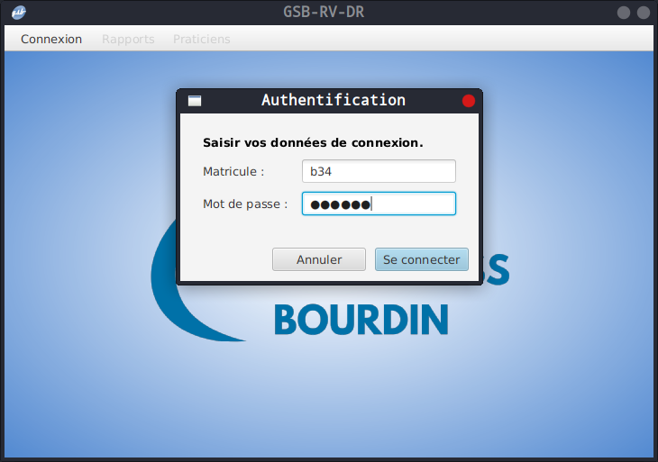
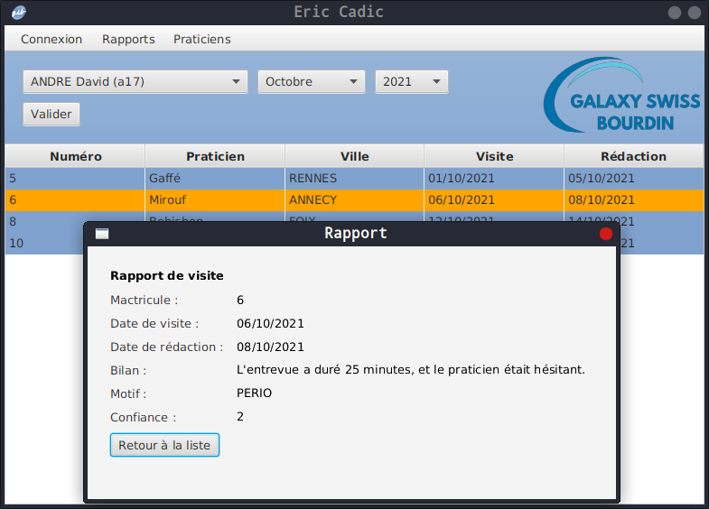

GSB RV DR [](#readme) [](https://github.com/Aaldn/GSB-RV-DR/blob/master/LICENSE.md)
========================

GSB RV DR – par [@Aaldn](https://github.com/Aaldn)

[](https://openjdk.java.net/) [](https://openjfx.io/) [](https://gradle.org/) [](https://mariadb.org/) 

Application d'enregistrement et de suivi des rapports de visite.

</img> </img> 

### Documentation

  * [Documentation utilisateur](docs/Documentation-Utilisateur.pdf) _(À venir)_
  * [Documentation technique](docs/Documentation-Technique.pdf) _(À venir)_

### Contexte

1. [GSB - Fiche descriptive](docs/01-GSB-AppliRV-FicheDescriptive.pdf)
2. [GSB - Cas d'utilisation](docs/02-GSB-AppliRV-DR-UC.pdf)
3. [GSB - Modèle Entité-Association](docs/03-GSB-AppliRV-MEA.pdf)

### Prérequis

  * [Java](http://jdk.java.net/17/) (+ définition de la variable d'environnement [JAVA_HOME](https://www.baeldung.com/java-home-on-windows-7-8-10-mac-os-x-linux#1-single-user))

  * [MariaDB](https://mariadb.org/download/?t=mariadb&o=true&p=mariadb&r=10.5.12&os=Linux&cpu=x86_64&i=systemd)

> En cas de difficulté, reportez-vous à la documentation officielle de [JavaFX](https://openjfx.io/openjfx-docs/) et de [MariaDB](https://mariadb.com/kb/en/documentation/).

## Installation

Tout d'abord, clonez ce dépôt puis placez-vous au sein du projet :

```bash
$ git clone https://github.com/Aaldn/GSB-RV-DR
$ cd GSB-RV-DR
```

Ensuite, créez la base de données et exécutez le script de peuplement :

```bash
$ mariadb -e "source sql/gsbrv.sql; source sql/peupler_gsbrv.sql;"
```

Enfin, lancez l'application :

```bash
$ ./gradlew run
```

## Licence

Voir le fichier [LICENSE.md](https://github.com/Aaldn/GSB-RV-DR/blob/master/LICENSE.md) fourni.